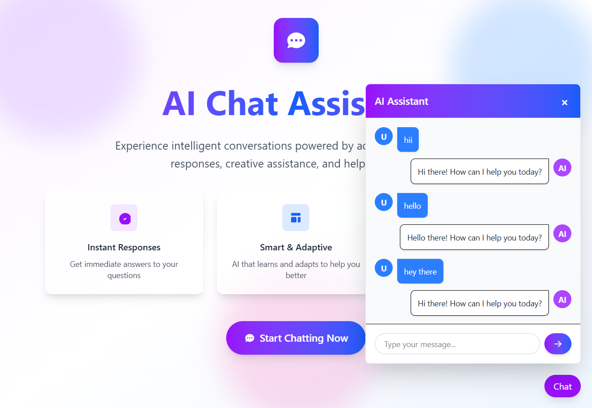

# AI Chat Assistant 🤖

A modern, responsive AI-powered chat application built with Next.js 15 and React 19. Experience intelligent conversations with a beautiful, intuitive interface.

## 🎯 Live Demo

**[https://chat-bot-alpha-ashy.vercel.app/](https://chat-bot-alpha-ashy.vercel.app/)**


## ✨ Features

- **🚀 Instant AI Responses** - Real-time chat with AI assistant
- **📱 Responsive Design** - Works perfectly on all devices
- **🎨 Modern UI/UX** - Beautiful gradient design with smooth animations
- **⚡ Fast Performance** - Built with Next.js 15 App Router
- **🔒 Secure API** - Built-in REST API for message handling

## 🛠️ Tech Stack

- **Framework:** Next.js 15 with App Router
- **Frontend:** React 19 + TypeScript
- **Styling:** Tailwind CSS 4
- **Database:** MongoDB
- **Deployment:** Vercel

## 🚀 Quick Start

```bash
# Clone the repository
git clone https://github.com/yourusername/ai-chat-assistant.git

# Install dependencies
npm install

# Create environment file
cp .env.example .env.local

# Add your environment variables to .env.local
MONGODB_URI=your_mongodb_connection_string
GEMINI_API_KEY=your_gemini_api_key

# Run development server
npm run dev
```

Open [http://localhost:3000](http://localhost:3000) to view the application.

**Required Environment Variables:**
- `MONGODB_URI` - MongoDB connection string
- `GEMINI_API_KEY` - Google Gemini API key for AI responses

## 📁 Project Structure

```
src/
├── app/
│   ├── api/messages/route.ts     # Chat API endpoint
│   ├── layout.tsx                # Root layout
│   └── page.tsx                  # Home page
├── components/
│   ├── FloatingButton.tsx        # Chat trigger button
│   └── ChatModal.tsx            # Chat interface
└── lib/
    └── mongodb.ts               # Database connection
```

## 🔌 API

**POST** `/api/messages`
```json
{
  "message": "Your message here"
}
```

## 🚀 Deployment

Deploy instantly on Vercel:

```bash
npm run build
```

## Contact
Name:- PATHAN UBEDULLAKHAN HASANKHAN                                                           
Email:- ubedpathan818@gmail.com                                                                
Portfolio:- https://ubedsportfolio.vercel.app/                                                 

## 📱 Screenshot


